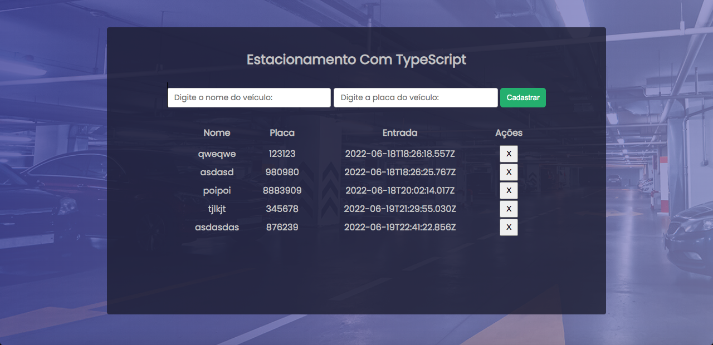

# Desafio de Projeto - Aprenda a criar um sistema de estacionamento usando TypeScript

Projeto desenvolvido para o **Desafio de Projeto - Aprenda a criar um sistema de estacionamento usando TypeScript** realizado no curso da [Digital Innovation One - DIO](https://www.dio.me/).

## Tela

## Referências

- [TypeScript Documentation](https://www.typescriptlang.org/docs/)
   
- [MDN Web Docs referência HTML](https://developer.mozilla.org/pt-BR/docs/Web/HTML/)
- [MDN Web Docs referência CSS](https://developer.mozilla.org/pt-BR/docs/Web/CSS/)
- [MDN Web Docs referência JavaScript](https://developer.mozilla.org/pt-BR/docs/Web/JavaScript/)
   
- [W3Schools referência HTML](https://www.w3schools.com/tags/default.asp)
- [W3Schools referência CSS](https://www.w3schools.com/cssref/default.asp)
- [W3Schools referência JavaScript](https://www.w3schools.com/jsref/default.asp)
